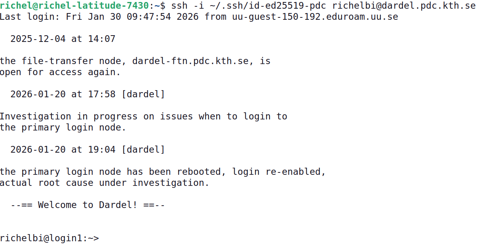
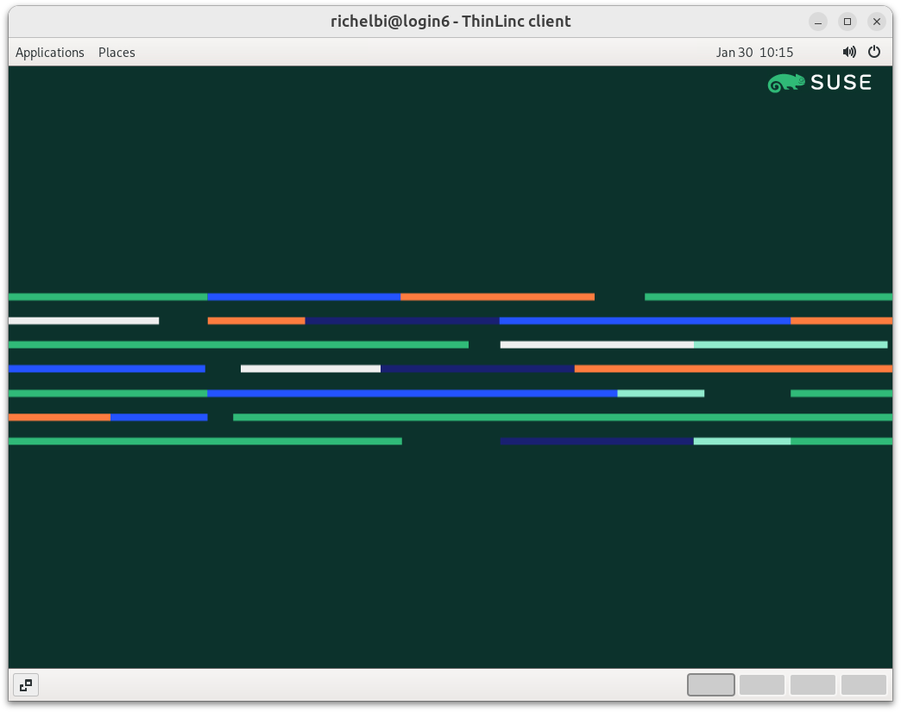
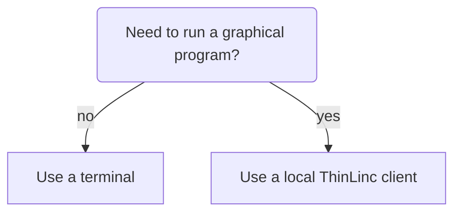

# Login

Here we describe the multiple ways to log in to Dardel.

The goal of this page is to help and redirect you to your favorite way to login.

Your favorite way to login depends mostly on which environment you prefer:

<!-- markdownlint-disable MD013 --><!-- Tables cannot be split up over lines, hence will break 80 characters per line -->

Parameter             |Console environment                |Desktop environment
----------------------|-----------------------------------|-----------------------------------
Screenshot            ||
Features              |Powerful                           |Intuitive
Program type needed   |SSH client                         |ThinLinc client
Example program names |`Terminal`, MobaXterm              |ThinLinc
Requires installation?|Probably                           |Most likely
Documentation         |[Documentation](ssh_login.md)      |[Documentation](interactive_hpc.md)

<!-- markdownlint-enable MD013 -->

Here is a decision tree, to determine which way to log in:

The procedures can be found at:

- [Login to the Dardel console environment](ssh_login.md)
- [Login to the Dardel remote desktop environment](interactive_hpc.md)
