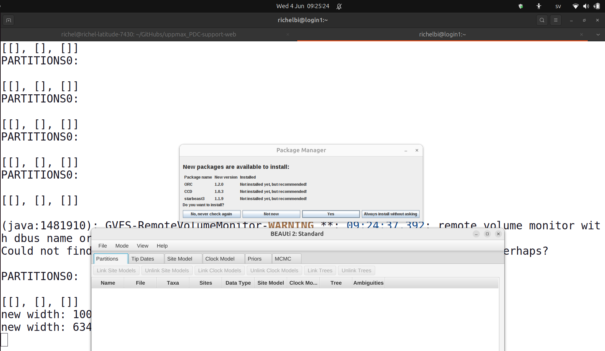

# BEAST2

BEAST2 is a tool for Bayesian phylogenetic analysis.

???- question "Is BEAST2 a new version of BEAST?"

    No.

    Although BEAST and BEAST2 achieve a similar goal,
    BEAST and BEAST2 are developed independently.

    Hence:

    - there are things BEAST can do that BEAST2 cannot, and vice versa
    - one cannot create a BEAST XML file
      and expect BEAST2 to be able to run it, and vice versa

## Using BEAST2

Here is how to use BEAST2 on the PDC clusters.

## 1. Load a `beast2` module

First step is to load a BEAST2 module.

Here is how to find the BEAST2 versions on the PDC clusters:

```bash
module spider beast2
```

???- question "How does the result look like?"

    You will see something similar to this:

    ```bash
    ----------------------------------------------------------------------------------------
      beast2:
    ----------------------------------------------------------------------------------------
         Versions:
            beast2/2.1.2
            beast2/2.3.1
            beast2/2.4.0
            beast2/2.4.8
            beast2/2.6.2
            beast2/2.6.3
            beast2/2.7.3
            beast2/2.7.4
            beast2/2.7.7

    ----------------------------------------------------------------------------------------
      For detailed information about a specific "beast2" package (including how to load the modules) use the module's full name.
      Note that names that have a trailing (E) are extensions provided by other modules.
      For example:

         $ module spider beast2/2.7.7
    ----------------------------------------------------------------------------------------
    ```


Here is how to lead a BEAST2 module:

```bash
module load beast2/2.7.7
```
???- question "How does the result look like?"

    You will see something similar to this:

    ```bash
    beast2/2.7.7: It is recommended (but optional) to load the library BEAGLE to use with Beast2!
    Please run `module spider beagle-lib` on how to load it and which versions of it that are available!
    ```

If you want to use BEAGLE too, run `module spider beagle-lib`
and pick the CPU or GPU module.


## 2. Run `BEAUti`



Next step is to create a BEAST2 configuration file
using `BEAUti`. This graphical tool can be started using:

```bash
beauti
```

`BEAUti` is a graphical program that can be launched from
a remote desktop environment or when using
SSH with X forwarding enabled.

After using `BEAUti`, save the file with your BEAST2 model.

## 3. Run

A BEAST2 run takes a lot of computing power,
hence do not run it on a login node.
Instead, run it in an interactive session
or use a script.

???- question "How to start an interactive session?"

    View [the PDC 'Run interactively' page](../../run_jobs/run_interactively.md).

On an interactive node, run BEAST2 on the saved BEAST2 model:

```bash
beast beast2_setup.xml
```

When using a script, put that line in a script.
Below is an example script, called `run_beast2.sh`:

```bash title="run_beast2.sh"
#!/bin/bash
#SBATCH -A uppmax2023-2-25
module load beast2/2.7.7
beast beast2_setup.xml
```

- In line 2, replace `uppmax2023-2-25` with your PDC project
- In line 3, you may want to replace `beast2/2.7.7`
  with your favorite BEAST2 version

Then run this script using `sbatch run_beast2.sh`.

Note that this is a *minimal* script.
See [the PDC documentation about job scripts](../../run_jobs/job_scripts/)
for ways to improve this script.

## View the trees using DensiTree


DensiTree is a tool that allows one to display the posterior tree distribution
of a BEAST2 run.

Run:

```bash
densitree [trees_filename]
```

where `[trees_filename]` is the name of the file containing the posterior trees,
resulting in, for example, `densitree my_file.trees`.

DensiTree is a graphical program that can be launched from
a remote desktop environment or when using
SSH with X forwarding enabled.
As it is a CPU heavy program, run it in an interactive session.

???- question "How to start an interactive session?"

    View [the PDC 'Run interactively' page](../../run_jobs/run_interactively.md).


## Run Tracer

Tracer is a tool to analyse the results of a
(BEAST or) BEAST2 run.

It is not installed on the PDC clusters.
[Contact PDC support](../../contact/contact_support.md)
if you need it.
